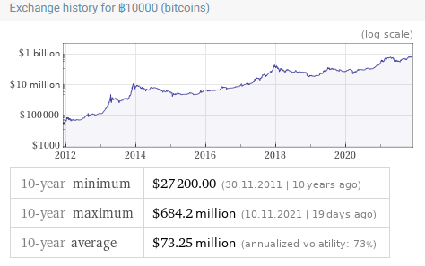
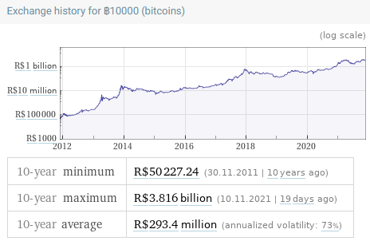

# Cryptography and Money

## Notes from *MIT 15.S12 Blockchain and Money, Fall 2018*

### Cryptography: Communications in the presence of adversaries

- Scytale Cipher (Roman)
- Enigma (1920-1940)
- Asymmetric Cryptography (1976)
- TCP/IP & Ethernet (1974)
- HTTP (1990)
- SSL/TLS (1996)

### Failed Cryptographic Digital Currencies:

- DigiCash (David Chaum) 1989
- Mondex (National Westminster Bank) 1993
- CyberCash (Lynch, Melton, Crocker & Wilson) 1994
- E-gold (Gold & Silver Reserve) 1996
- Hashcash (Adam Back) 1997
- Bit Gold (Nick Szabo) 1998
- B-Money (Wei Dai) 1998
- Lucre (Ben Laurie) 1999

### Bitcoin: A Peer-to-Peer Electronic Cash System

> [Satoshi Nakamoto Sat, 01 Nov 2008 16:16:33 -0700](https://www.mail-archive.com/cryptography@metzdowd.com/msg09959.html)\
> Bitcoin P2P e-cash paper
>
> I've been working on a new electronic cash system that's fully
> peer-to-peer, with no trusted third party.
>
> The paper is available at: http://www.bitcoin.org/bitcoin.pdf

### Market??

> [May 18, 2010, 12:35:20 AM](https://bitcointalk.org/index.php?topic=137.msg1141#msg1141)
>
> I'll pay 10,000 bitcoins for a couple of pizzas..
>
> [...]
>
> [May 21, 2010, 07:06:58 PM](https://bitcointalk.org/index.php?topic=137.msg1181#msg1181)
>
> So nobody wants to buy me pizza?  Is the bitcoin amount I'm offering too low?
>
> [May 22, 2010, 07:17:26 PM](https://bitcointalk.org/index.php?topic=137.msg1195#msg1195)
>
> I just want to report that I successfully traded 10,000 bitcoins for pizza.
>
> Pictures: http://heliacal.net/~solar/bitcoin/pizza/
>
> Thanks jercos!

[^pizza]: https://bitcointalk.org/index.php?topic=137.msg1141

### Market!

22 May 2010: BTC $10\,000$ = USD $41$ for 2 pizzas

9 November 2021 15:39:02: BTC $10\,000$ = USD $540.3$ million

<!-- [Cryptocurrencies hit market cap of $3$ trillion for the first time] -->

Yet Modest in Relation to Global Capital Markets

Million, $10^6$\
Billion, $10^9$\
Trillion, $10^{12}$

|Market| Valuation |
|---|----|
| Global Equity Markets |   [USD 105 Trillion][^2] 2020  |
| > US Equity Market |   [USD 40 Trillion][^1] 2020  |
| > CH Equity Market |   [USD 12 Trillion][^1] 2020  |
| > BR Equity Market |   [USD 0.988 Trillion][^1] 2020  |
| Global Debt & Bond Markets |  [USD 123 Trillion][^2] 2020  |
| Global Holding of Gold |  [USD 8 Trillion][^3] 2018  |
| Global Holding of Cryptocurrencies |  [USD 3 Trillion][^4] 2021  |

[^1]: https://data.worldbank.org/indicator/CM.MKT.LCAP.CD?end=2020&most_recent_value_desc=true&start=1975&type=shaded&view=chart
[^2]: https://www.sifma.org/wp-content/uploads/2021/07/CM-Fact-Book-2021-SIFMA.pdf
[^3]: https://www.statista.com/statistics/1125923/global-market-value-of-gold/
[^4]: https://fortune.com/2021/11/09/cryptocurrency-market-cap-3-trillion-bitcion-ether-shiba-inu/
